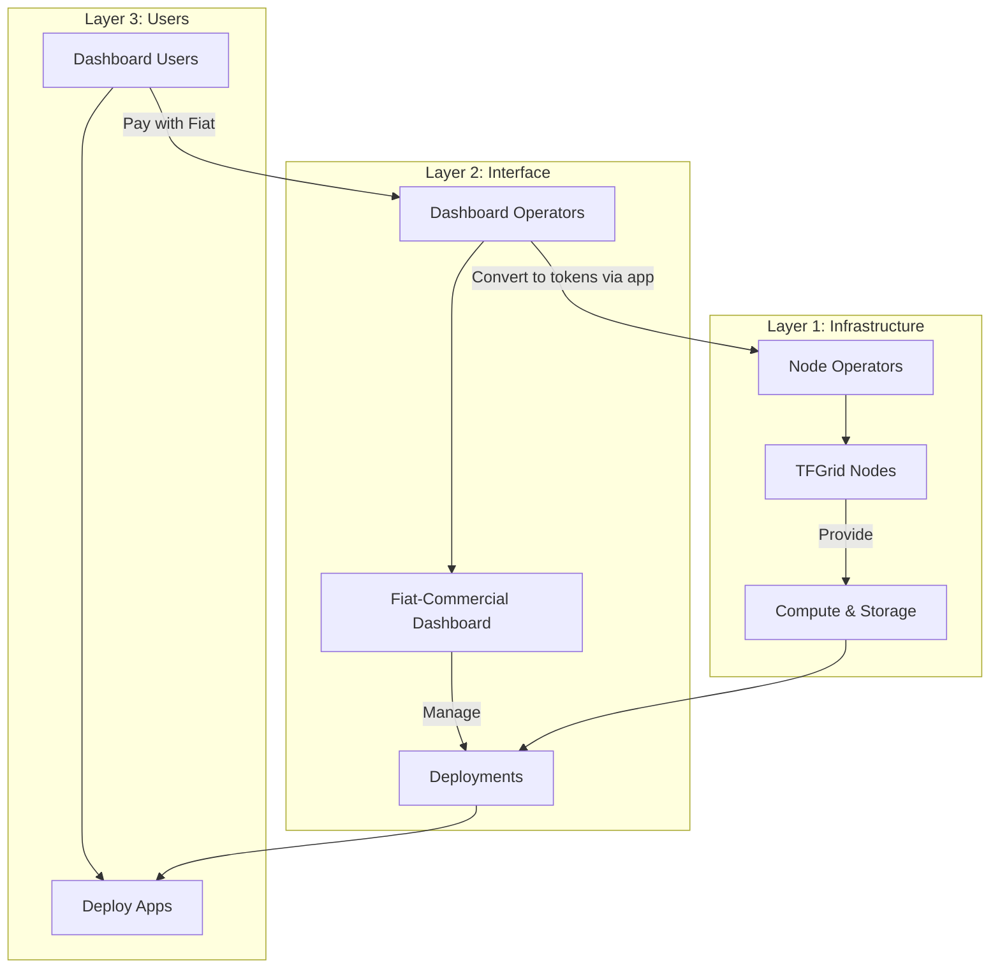
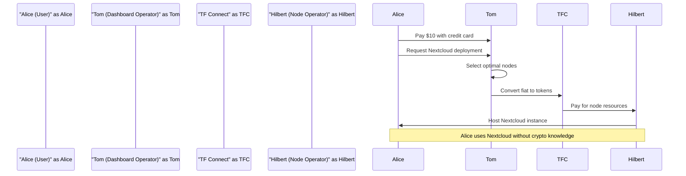
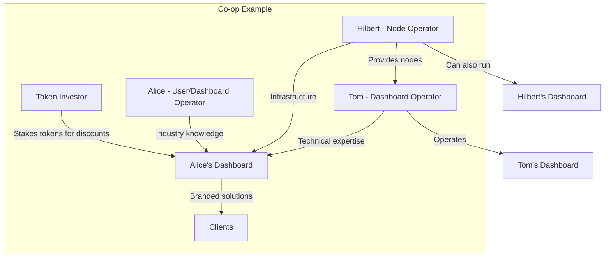

# Fiat-Commercial Dashboard with Co-operators & TF Connect Proposal 🌍

## What's Your Take on This Idea?

I'm glad to present a proposal to the community based on **years of feedback** from users and farmers - a **new way** to bring ThreeFold's decentralized grid to everyone!

**How?** Through a **Fiat-Commercial Dashboard** where users pay with simple credit/debit cards, while **co-operators** — Node Operators and Dashboard Operators — collaborate to power and deliver cloud solutions.

This creates a powerful **three-layer ecosystem**:
- **Node Operators** (Layer 1) provide the infrastructure
- **Dashboard Operators** (Layer 2) deliver user-friendly interfaces
- **Dashboard Users** (Layer 3) deploy apps effortlessly

> Note: For this presentation, we use the term node operators instead of farmers.

Just as ThreeFold's technology is built on three foundational layers (network, compute, and storage), this cooperative model mirrors that triadic approach with its own three-layer system.

The beauty of this system is its *flexibility* - roles can be distinct or combined in co-ops to customize offerings for specific markets and needs.

**Ready to explore this game-changing approach?** Share your thoughts! 😄

## 💡 The Vision: Three Layers of Simplicity and Collaboration

### The Three-Layer Ecosystem Structure

The TFGrid operates in three distinct but interconnected layers, each driven by **co-operators** who play specific roles. This structure creates a *seamless flow* from infrastructure to user experience, bridging **traditional payment methods** with **blockchain technology**.

**Diagram Summary:** This flowchart illustrates how the three layers interact with each other. **Node Operators** (Layer 1) provide the infrastructure through TFGrid Nodes, offering compute and storage resources. **Dashboard Operators** (Layer 2) create user-friendly interfaces through Fiat-Commercial Dashboards that manage deployments. **Dashboard Users** (Layer 3) simply deploy and use apps. The financial flow is elegantly handled: users pay with *fiat currency* to Dashboard Operators, who then convert this to tokens via **TF Connect** to compensate Node Operators, creating a *complete circular economy*.

### 1. Understanding the Roles

- **Layer 1: Node Operators (e.g., Hilbert)**
  - Run TFGrid nodes to provide compute and storage.
  - Nodes are **self-healing** - simply connect to internet and electricity, power on, and they automatically update and maintain themselves.
  - Nodes are automatically listed on ThreeFold's public Fiat-Commercial Dashboard *unless allocated* to custom dashboards by co-ops.
  - **Earn tokens** from user deployments on their nodes.
  - Receive **50% of the deployment cost** paid by users (specifically the TFChain part, not including any markup added by Dashboard Operators).

- **Layer 2: Dashboard Operators (e.g., Tom)**
  - Host Fiat-Commercial Dashboards (public or custom) that offer **both basic and advanced interfaces**:
    - **Basic View**: Automatically selects optimal nodes for deployments (no manual selection needed)
    - **Advanced View**: Provides detailed filters allowing users to select specific nodes or farms
  - Set pricing, integrate *fiat payments* (e.g., Stripe), and use **TF Connect** to automate token purchases for grid costs.
  - Form **co-ops** with Node Operators to customize offerings.
  - Enjoy a **60% discount** on deployments when holding tokens in their wallet, allowing for *competitive pricing* and *better margins*.
  - Provide **clear Service Level Agreements (SLAs)** to users, defining availability, performance, and backup options.

- **Layer 3: Dashboard Users (e.g., Alice)**
  - Deploy apps (e.g., Nextcloud, Kubernetes) via dashboards using credit/debit cards, **no crypto needed**.
  - Choose between **basic view** (automatic node selection) or **advanced view** with filters to:
    - Deploy on specific geographic locations
    - Select nodes with particular specifications
    - **Deploy on their own nodes** if they're also Node Operators
    - Apply custom filters based on reliability, price, or other metrics
  - Enjoy a *seamless UX* with resilience options like:
    - **Backup VMs** that provide redundancy if the primary VM fails
    - **Quantum Safe File System (QSFS)** for distributed data storage
  - Understand that while backup VMs provide significant protection, *data loss could still occur* if both primary and backup VMs fail simultaneously.
  - Can and should set up **local backups to their own hardware** for critical data as an additional security layer, ensuring data remains accessible even if grid services are temporarily unavailable.

### 2. A Practical Example: The User Journey

Let's explore how these roles interact in a *real-world scenario* to demonstrate the simplicity and power of this system for all participants.

**Scenario Introduction:** Alice, a small business owner, wants a Nextcloud instance for $10/month. She logs into Tom's custom Fiat-Commercial Dashboard, pays with her credit card, and deploys Nextcloud. Using the **advanced view**, she filters for nodes in her region and selects the option for a **backup VM** to ensure higher availability according to Tom's SLA. The dashboard **automatically** finds and allocates the best-matching nodes from Hilbert's farm (and other Node Operators) based on her filters - no manual intervention from Tom is needed. Tom's system manages fiat payments and uses **TF Connect** to buy tokens, paying Hilbert's self-healing nodes. For added security, Alice configures her Nextcloud to perform weekly backups to her local NAS storage. This way, even in the rare case that both her primary and backup VMs fail, she still has access to her critical business data. Alice gets a *secure, user-friendly cloud solution* without touching crypto.

**Sequence Diagram Explanation:** This diagram shows the step-by-step process of how Alice's request flows through the system. First, Alice pays Tom using her credit card and requests a Nextcloud deployment. Tom's dashboard then **automatically** selects the *optimal nodes* for hosting based on Alice's filters (or makes the selection automatically if she used the basic view), converts Alice's payment to tokens using TF Connect, and sends the appropriate payment to Hilbert's nodes. Finally, Hilbert's self-healing infrastructure hosts the Nextcloud instance that Alice can access and use **without ever needing to understand** the underlying blockchain technology. The entire process is *streamlined*, with each party handling their specialized role in the ecosystem.

## 3. Combining Roles Through Co-ops

### Flexible Collaboration Models

Co-operators can **blend roles** and form co-ops to create *tailored solutions*, allowing for maximum flexibility and innovation in the ecosystem:

- **Flexibility:** Anyone (Alice, Tom, Hilbert) can become a Dashboard Operator, host a custom dashboard, and market *branded products* (e.g., Alice's Nextcloud for businesses, Tom's Kubernetes for devs).
- **Node Operators as Dashboard Operators:** Hilbert, a Node Operator, can also run a dashboard, deploying apps on his own nodes. He pays TFChain's base cost plus any dashboard margin but can apply a *discount code* to waive the extra for himself or partners.
- **Co-op Collaboration:** Multiple Node Operators (e.g., Hilbert and others) can team up with one or more Dashboard Operators to host a single dashboard instance, *pooling nodes* for reliability and scale. For example, Tom's dashboard could use nodes from Hilbert's farm and other farmers to ensure **high availability** for Alice's apps.
- **Custom Co-ops:** Alice could become a Dashboard Operator, form a co-op with Tom and Hilbert, and launch a *branded dashboard* using Hilbert's nodes, marketing it to her industry.
- **Dashboard Investors:** Individuals or organizations can **stake significant amounts** of tokens for co-ops to enable the 60% discount without being directly involved in operations. These investors participate in the co-op's success while enabling the dashboard to operate *more competitively*.

### Visualizing Co-op Relationships

The following diagram illustrates how different participants can interact within co-ops, creating a *dynamic and adaptable ecosystem*:

**Co-op Diagram Breakdown:** This diagram shows the *flexible relationships* possible within the ecosystem. In the central "Co-op Example," we see how Hilbert provides nodes to Tom while also contributing infrastructure to Alice's Dashboard. Tom brings **technical expertise** to Alice's Dashboard, while Alice herself contributes **industry knowledge**. An external Token Investor stakes tokens to enable discounts. Alice's Dashboard then delivers *branded solutions* to clients. Outside the co-op, we can see that Hilbert can also operate his own dashboard, as can Tom, demonstrating the *versatility of roles* within the system.

### Co-op Scenario Example

Hilbert, a Node Operator, joins Tom's co-op to allocate nodes to Tom's dashboard. Hilbert also runs his **own dashboard** for developers, deploying Kubernetes clusters on his nodes and using a discount code to reduce costs. Meanwhile, Alice, inspired by her experience, becomes a Dashboard Operator, teams up with Tom and Hilbert in a co-op, and launches "*Alice's Secure Storage*" using nodes from Hilbert and other farmers. Their co-op also brings in an **investor who stakes tokens** to enable the 60% discount on deployments, making them more competitive. The co-op *collectively decides* on revenue sharing, with Alice focusing on marketing, Tom on technical operations, and Hilbert providing infrastructure, each compensated based on their *agreed contribution model*.

## 4. Economic Incentives & Co-op Autonomy

### Financial Benefits for All Participants

The ecosystem creates **compelling economic incentives** for all participants:

- Dashboard Operators can achieve up to **60% discount** on deployments by holding tokens in their wallet, significantly improving their *competitiveness* and *profit margins*.
- Node Operators receive **50% of deployment costs** paid by users (specifically the TFChain portion, not any additional markup from Dashboard Operators).
- Node Operators who also hold tokens can enjoy *discounts when deploying solutions* themselves, creating a dual benefit.
- Co-ops have **complete autonomy** and responsibility to decide how they distribute payments, profits, and responsibilities among members. This allows for *flexible arrangements*:
  - Revenue sharing based on contribution
  - Flat-fee models for certain participants
  - Performance-based incentives
  - Specialized roles with differentiated compensation
  - Custom governance models for decision-making

### Governance and Autonomy

Co-ops operate with **full autonomy** and responsibility to determine their internal structures, decision-making processes, and economic models. This *self-governance approach* aligns with ThreeFold's core philosophy of **decentralization** and **community empowerment**. Co-ops can establish their own:

- Voting mechanisms for key decisions
- *Profit-sharing formulas*
- Entry and exit procedures for members
- Specialization of roles within the co-op
- *Marketing and branding strategies*

## 🚀 Join Us in Shaping the Future of ThreeFold

We believe the Fiat-Commercial Dashboard with Co-operators model represents a **significant step forward** in making decentralized cloud infrastructure accessible to everyone. By **bridging the gap** between traditional payment methods and blockchain technology, we're *removing barriers to entry* while preserving the core values of ThreeFold's decentralized vision.

### Benefits for Different Stakeholders

This ecosystem **empowers individuals and organizations** at all levels:
- **For Users**: Simplified access to *secure, private cloud services* without crypto knowledge
- **For Node Operators**: *Expanded market reach* and increased utilization of infrastructure
- **For Dashboard Operators**: Ability to create *customized cloud solutions* and build businesses on top of the ThreeFold Grid without managing physical infrastructure
- **For Entrepreneurs**: *New business opportunities* through dashboard operations and co-op formations
- **For Investors**: Ways to participate in the ThreeFold ecosystem by *staking tokens* to support co-ops

### We Want Your Feedback

We want to know if you think this is a good idea for ThreeFold. Your feedback is **crucial at this stage** as we assess the viability of this approach. If we receive *positive feedback* from the community, we will evaluate how to implement this within our upcoming roadmap based on our current resources and effectiveness.

**👍 Like this post** if you support this direction for ThreeFold.

**💬 Share your detailed feedback** in the comments below. What do you like about this proposal? What concerns do you have? How would you improve it?

**🔄 Help spread the word** by sharing this post with others who might be interested in ThreeFold's evolution.

Your input will *directly influence* whether and how we move forward with this concept. This is your opportunity to **shape the future** of the ThreeFold ecosystem in a meaningful way.
