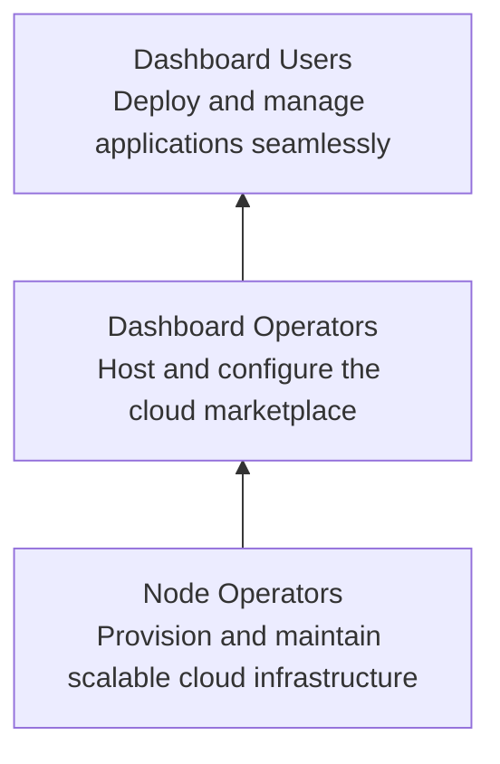

# Ecosystem Overview

The ThreeFold Cloud Marketplace implements a robust three-layer system to deliver a full-stack, circular cloud economy—by the people, for the people. Each layer plays a distinct role in powering a transparent, scalable, and user-friendly marketplace.

## Layer 1: Node Operators

Node Operators provision and maintain scalable TFGrid nodes, delivering compute, storage, and network resources to the grid.

- Earn **50%** of the TFChain portion of each deployment cost.
- Ensure high availability, security, and automatic updates.
- Form co-ops to pool resources and establish clear Service Level Agreements (SLAs).

## Layer 2: Dashboard Operators

Dashboard Operators host and configure the fiat-to-blockchain marketplace interface, enabling seamless user deployments.

- Integrate payment gateways (e.g., Stripe) and automate token acquisition via TF Connect.
- Define pricing models, node-selection filters, and Basic/Advanced deployment options.
- Unlock **up to 60%** deployment discounts by staking or holding tokens.

## Layer 3: Dashboard Users

Dashboard Users enjoy a seamless, non-crypto deployment experience using credit or debit cards.

- Deploy applications using **Basic** (auto node assignment) or **Advanced** (custom filters) modes.
- Configure backups and Quantum Safe File System (QSFS) for data resilience.
- Monitor deployments, scale resources, and manage application settings.

## Circular Economy & Collaboration

This ecosystem fosters a circular economy:

1. **By the people**: Anyone can join as a provider or contributor at any layer.
2. **For the people**: Transparent revenue sharing, co-op governance, and open collaboration.
3. **Synergy**: Operators and users co-create value, driving adoption and grid expansion.

## Best Practices

- Establish and document SLAs and governance within co-ops.
- Continuously monitor performance and collect user feedback.
- Automate updates, backups, and security checks for reliability.
- Leverage token-based incentives to optimize pricing and revenue-sharing.

Use this guide to understand and engage with the ThreeFold Cloud Marketplace ecosystem effectively.