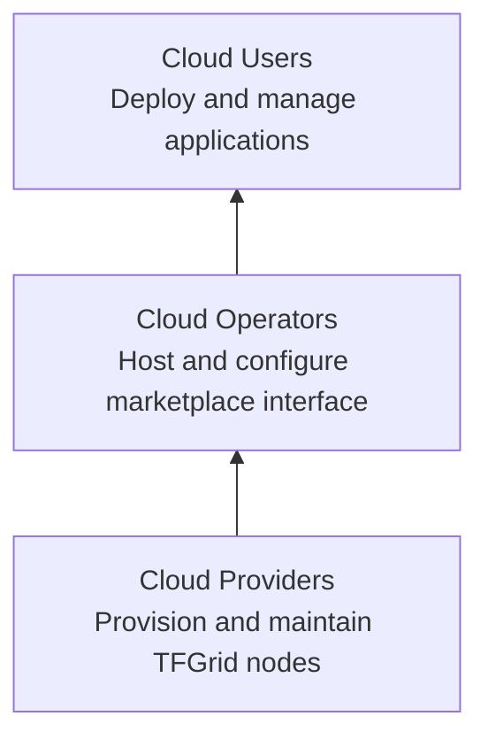
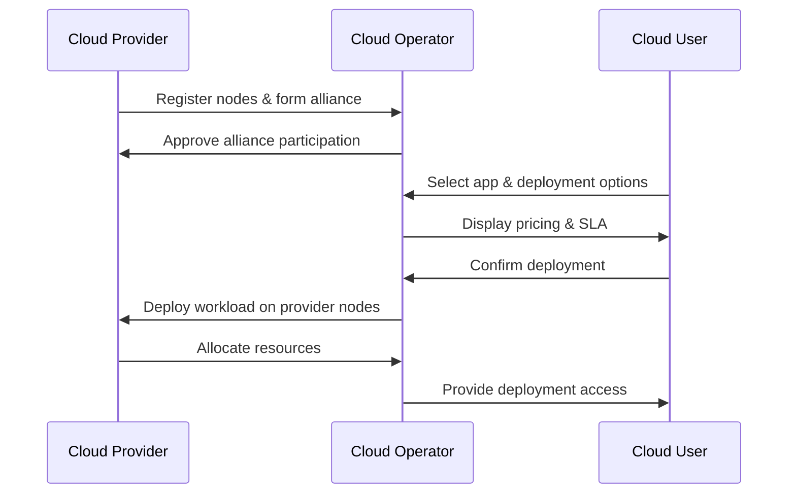
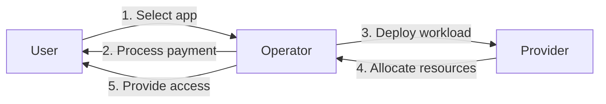
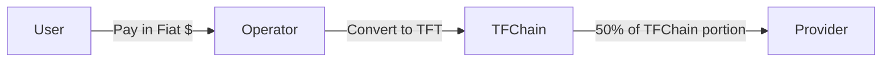
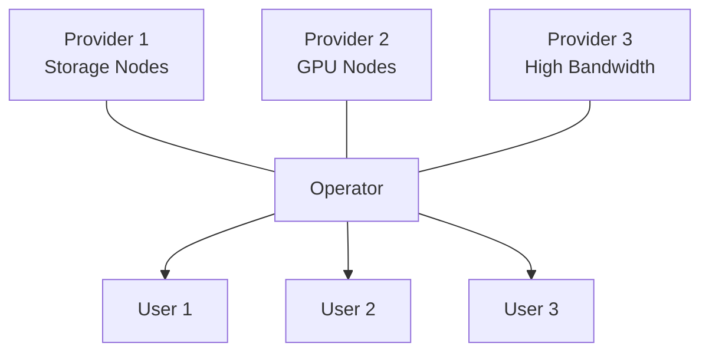
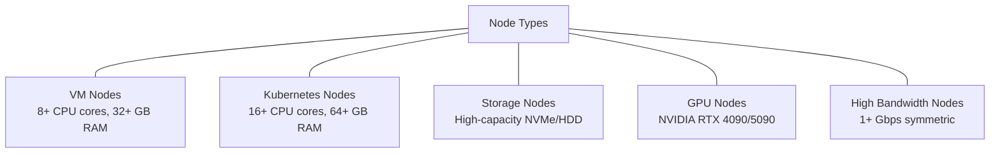
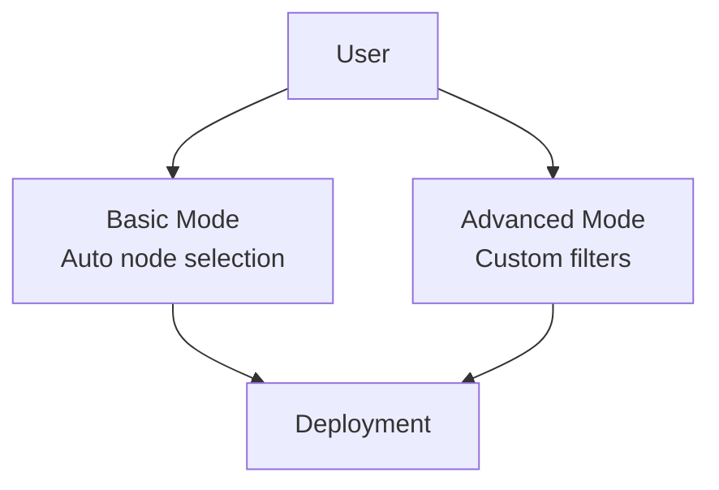
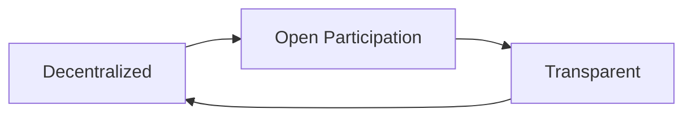

# The Big Picture

This document provides visual representations of the ThreeFold Cloud Marketplace ecosystem, illustrating the relationships between Cloud Providers, Cloud Operators, and Cloud Users.

## Ecosystem Layers

The ThreeFold Cloud Marketplace implements a three-layer system to deliver a decentralized cloud economy. This diagram shows the hierarchical relationship between the three main participants, with Cloud Providers forming the foundation, Cloud Operators building the marketplace layer, and Cloud Users consuming services at the top.



## Interaction Flow

This sequence diagram illustrates the chronological flow of interactions between the three participants, showing how they communicate and collaborate throughout the setup, deployment, and operational phases of the marketplace.



## Deployment Flow

This diagram shows the step-by-step process of deploying an application, from the user's initial selection to the final access provision. It highlights how the three participants work together to create a seamless deployment experience.



## Token Economics

This diagram illustrates the flow of payments and token conversions in the ecosystem. It shows how fiat payments from users are converted to TFT tokens by operators, and how providers receive a portion of these tokens as payment for their resources.



## Cloud Alliances

This diagram depicts how Cloud Alliances form strategic partnerships between providers with different node specializations and operators. These alliances enable the delivery of specialized services to users with specific requirements.



## Node Types

This diagram showcases the various types of nodes that Cloud Providers can offer, each optimized for different workloads and use cases. The diversity of node types enables a wide range of applications to be deployed on the ThreeFold Grid.



## User Deployment Options

This diagram illustrates the two deployment modes available to users: Basic mode with automatic node selection for simplicity, and Advanced mode with custom filters for more control. Both paths lead to successful deployments with different levels of user involvement.



## Circular Economy Benefits

This diagram represents the circular nature of the ThreeFold ecosystem, showing how decentralization leads to open participation, which enables transparency, which in turn reinforces decentralization. This virtuous cycle creates a sustainable and equitable cloud economy.



## Complete Ecosystem Overview

This comprehensive diagram brings together all aspects of the ThreeFold Cloud Marketplace, showing the relationships between participants, their key functions, and how they interact to create a complete cloud ecosystem. It provides a bird's-eye view of the entire marketplace structure.

```mermaid
graph BT
  CP["Cloud Providers"] --> CO["Cloud Operators"] --> CU["Cloud Users"]
  
  CP --- NODES["TFGrid Nodes"]
  CP --- ALLIANCE1["Form Cloud Alliances"]
  
  CO --- DASH["Marketplace Dashboard"]
  CO --- PAY["Payment Processing"]
  CO --- ALLIANCE2["Join Cloud Alliances"]
  
  CU --- DEPLOY["Deployment Options"]
  CU --- MONITOR["Monitoring & Management"]