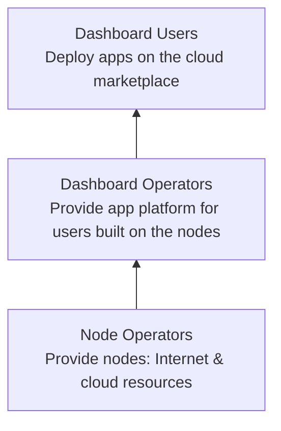

# Welcome

The ThreeFold Cloud Marketplace is built on a three-layer ecosystem to ensure a cohesive and complete circular economy—by the people, for the people. Below is a three-layer vertical flow from bottom to top, illustrating how each layer builds upon the previous one:

Use the sidebar to explore each role in detail.

## What's New

- Enhanced **Node Operator Request Form**: specify Node ID, Network (Main/Test), multi-app selection, Contact Email, SLA agreement, and comments.
- **Pending Participation Requests** view for Node Operators and Dashboard Operators detailing Node ID, Network, Apps, Email, SLA status, comments, and request date.
- **Nodes in Co-ops** table: shows accepted co-op nodes with Name, Node ID, and Apps Accepted.
- **Maintenance Scheduling**: Node Operators can schedule maintenance windows (start/end times + comments) per node; forms and listings available.
- **Pending Maintenance Windows** view for pending maintenance requests.
- **Dashboard Operator** management: handle join requests (approve/deny) and manage maintenance windows.
- **Dashboard User** notifications: users are informed of scheduled maintenance windows affecting their deployments.
