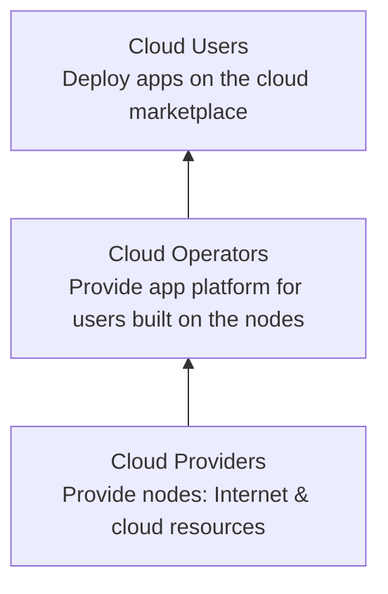

# Welcome

The ThreeFold Cloud Marketplace is built on a three-layer ecosystem to ensure a cohesive and complete circular economy—by the people, for the people. Below is a three-layer vertical flow from bottom to top, illustrating how each layer builds upon the previous one:

## Overview

The ThreeFold Cloud Marketplace is an open, decentralized platform that unites community-driven infrastructure with streamlined application services. Cloud Providers supply the underlying compute and storage resources, Cloud Operators deploy and manage applications on that infrastructure, and Cloud Users leverage these applications to deliver workloads globally.